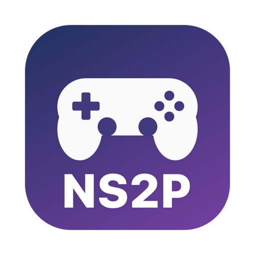
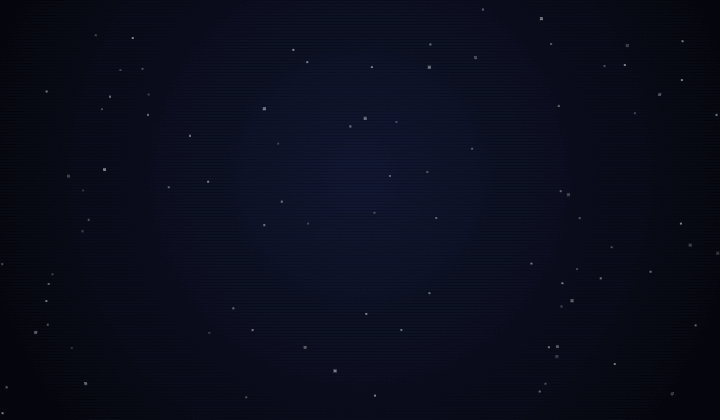
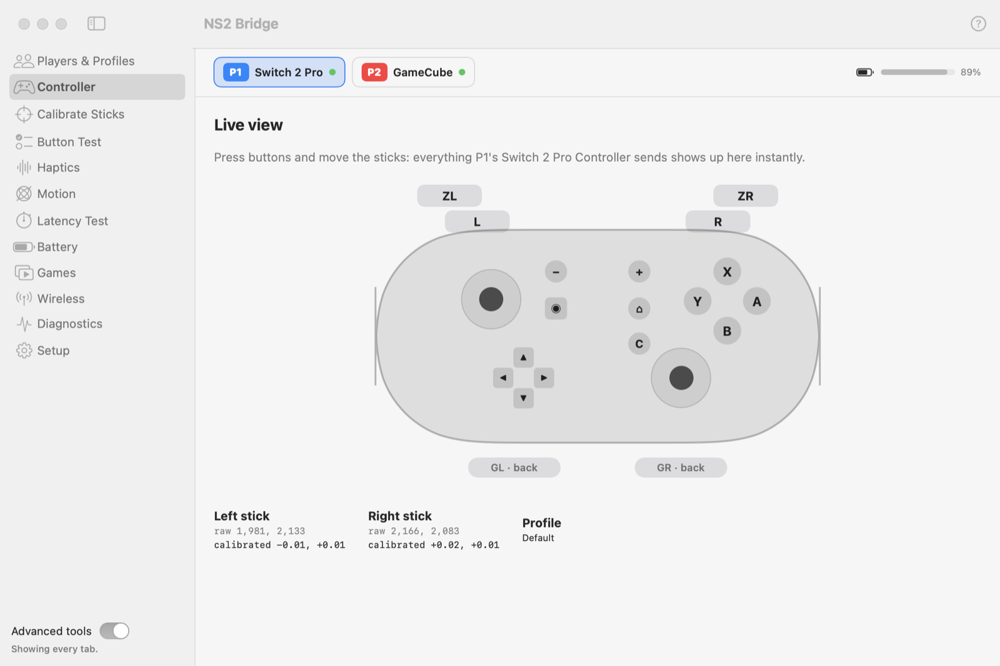

<p align="center"></p>

<h1 align="center">NS2 Bridge</h1>

<p align="center">
<b>Switch 2 Pro, NSO GameCube and NSO N64 controllers on your Mac</b>, over USB or Bluetooth,<br>
with rumble, gyro and analog triggers, in games and emulators.
</p>

<p align="center">
<a href="https://github.com/info-moed/NS2Bridge/releases/latest"></a>

<a href="https://github.com/info-moed/NS2Bridge/actions/workflows/ci.yml"></a>
<a href="LICENSE"></a>
</p>

<p align="center">
<a href="https://info-moed.github.io/NS2Bridge/"><b>Website and documentation</b></a> ·
<a href="https://github.com/info-moed/NS2Bridge/releases/latest"><b>Download</b></a> ·
<a href="docs/guide/getting-started.md">Getting started</a> ·
<a href="docs/reference/troubleshooting.md">Troubleshooting</a>
</p>

<p align="center"></p>

<picture>
  <source media="(prefers-color-scheme: dark)" srcset="docs/images/tab-controller-dark.png">
  
</picture>

> **Unofficial.** Not affiliated with or endorsed by Nintendo, Microsoft or Apple. See [LEGAL.md](LEGAL.md).
> Native Swift app, no drivers to install, no account, no telemetry. Free and open source (MIT).

## Why

- A **Switch 2 Pro** or **Switch 2 NSO GameCube** controller plugged into a Mac **sends nothing** until
  a host sends it a start-up command. NS2 Bridge sends it the moment you plug one in.
- Games read these controllers through SDL, which on macOS can't make them rumble, reads the
  GameCube's sticks at only ~60% of their travel, and in some games (e.g. BattleShip) is told to switch
  off the driver the **N64** controller needs, so its input goes haywire. NS2 Bridge fixes all three.
- Emulators want gyro over DSU (CemuHook). NS2 Bridge serves every connected controller that way.

## What works

✅ = verified on real hardware. 🧪 = built and unit-tested, not yet tried on a real controller.

| | Switch 2 Pro | NSO GameCube | NSO N64 |
|---|---|---|---|
| Plug-and-play USB (set up on plug-in and after sleep) | ✅ | ✅ | ✅ |
| All buttons, sticks (+ GameCube analog triggers) | ✅ 21 buttons | ✅ 16 buttons, analog L/R | ✅ 17 buttons |
| Rumble tests in the app | ✅ HD Rumble 2, both motors/bands | ✅ | ✅ |
| **Rumble in games** (helper: SDL2 and SDL3) | ✅ Wave Race 64 Recomp, BattleShip | ✅ BattleShip | ✅ Wave Race 64 Recomp, BattleShip |
| Full stick range in games (NS2 Bridge's calibration applied) | 🧪 | ✅ (was ~60%) | ✅ (SDL's own driver) |
| Bluetooth | ✅ input and gyro, **133 reports/s** (7.5 ms) | ✅ (7.5 ms setting 🧪) | 🧪 (pair in macOS settings) |
| **Games over Bluetooth** (helper's virtual gamepad, like Steam Input) | ✅ BattleShip (with gyro), Wave Race 64 Recomp | 🧪 | — (macOS shows it to games itself) |
| Turn off to save battery (wireless) | 🧪 | ✅ | 🧪 |
| Gyro / accelerometer (+ live 3D view) | ✅ USB and Bluetooth | — (none) | — (none) |
| DSU (CemuHook) server for emulators | ✅ incl. gyro | ✅ buttons, sticks, triggers | ✅ buttons, stick |
| Battery level / voltage | ✅ level | ✅ level | ✅ voltage |

And for every controller:

- **Games tab:** checks how a game does rumble and fixes what it can, launches games with rumble,
  or installs a small helper into games whose signing blocks that (originals backed up, one click to
  restore). ✅ Verified with BattleShip; the installed helper can be updated in place.
- **Protection against broken N64 input:** keeps SDL's N64 driver on in every game and warns you if a
  game still ends up misreading it. ✅ Verified against BattleShip, which switches the driver off.
- **Menu bar:** one pill per controller in its player color (**GC** blue = P1, **N64** red = P2,
  **PC2** yellow = P3, green = P4…). Click for its menu, double-click to turn it off. ✅
- **Each controller remembers its own settings:** its own profile (calibration, vibration, gyro offset)
  comes back whenever it reconnects, by cable or Bluetooth. ✅
- **Calibration:** sticks (live trace, deadzones), GameCube analog triggers (trigger test), gyro offset.
- **Diagnostics:** button test, live color-coded report bytes, recordings, latency test, battery history.
- **Multiple controllers:** players P1–P8 with player lights, per-type profiles. ✅ Tested with two at once.
- 🧪 Rumble with no changes to games (macOS force-feedback plug-in): works in a test harness, not yet
  confirmed in a real game.
- **Demo mode:** explore every tab with two recorded controllers, no hardware needed. ✅
- ❌ Native Mac games that use Apple's GameController framework: that needs a DriverKit driver, which
  needs a paid Apple Developer account.

## Quick start

1. **Download** `NS2Bridge-<version>-macOS.zip` from the [latest release](https://github.com/info-moed/NS2Bridge/releases/latest),
   drag **NS2 Bridge.app** to Applications, and allow it once in **System Settings → Privacy & Security → Open
   Anyway** (it isn't signed with a paid Apple Developer ID). Or with Homebrew: `brew install --cask info-moed/tap/ns2bridge`.
2. **Connect** a controller with a USB-C **data** cable, or over Bluetooth from the **Wireless** tab.
3. **Play:** emulators read it over DSU (gyro, analog triggers); SDL games get rumble and Bluetooth controllers when
   launched from the **Games** tab. The welcome tour walks you through it.

No controller at hand? **Setup → Demo mode** plays back two recorded controllers.

## Documentation

| For | Read |
|---|---|
| Everyone | [Getting started](docs/guide/getting-started.md) · [User guide](docs/guide/index.md) (every tab) · [Install and uninstall](docs/INSTALL.md) |
| Playing | [Games](docs/guide/games.md) · [Emulators (DSU)](docs/guide/emulators.md) · [Bluetooth](docs/guide/bluetooth.md) |
| Help | [Troubleshooting](docs/reference/troubleshooting.md) · [FAQ](docs/reference/faq.md) · [Compatibility](docs/reference/compatibility.md) · [Support](SUPPORT.md) |
| Details | [Privacy](docs/reference/privacy.md) · [Settings and files](docs/reference/settings-and-files.md) · [Glossary](docs/reference/glossary.md) |
| Developers | [For developers](docs/DEVELOPMENT.md) · [Architecture](docs/ARCHITECTURE.md) · [Controller protocol](docs/PROTOCOL.md) · [Helper protocol](docs/reference/helper-protocol.md) · [Research evidence](research/) · [Contributing](CONTRIBUTING.md) |

The same docs, with search, at **[info-moed.github.io/NS2Bridge](https://info-moed.github.io/NS2Bridge/)**.

## Build from source

```bash
git clone https://github.com/info-moed/NS2Bridge.git && cd NS2Bridge
swift test                      # unit tests, no controller needed
./scripts/build-app.sh          # → build/NS2 Bridge.app (universal, ad-hoc signed)
```

Requires macOS 15+ and Xcode 16+ (or its command-line tools). No Apple Developer account.

## Contributing

Compatibility reports, bug reports with a diagnostics report, protocol findings with evidence, documentation fixes
and code are all welcome: see [CONTRIBUTING.md](CONTRIBUTING.md). Questions go to
[Discussions](https://github.com/info-moed/NS2Bridge/discussions). Please follow the [Code of Conduct](CODE_OF_CONDUCT.md);
security issues go to [SECURITY.md](SECURITY.md).

## Credits

Built on public research by the community, especially
[ndeadly's switch2_controller_research](https://github.com/ndeadly/switch2_controller_research),
[SDL](https://github.com/libsdl-org/SDL), [dekuNukem's Switch notes](https://github.com/dekuNukem/Nintendo_Switch_Reverse_Engineering),
[Dolphin](https://github.com/dolphin-emu/dolphin) and [libultraship](https://github.com/Kenix3/libultraship).
Details: **[THIRD_PARTY_NOTICES.md](THIRD_PARTY_NOTICES.md)**.

## Legal

MIT licensed (**[LICENSE](LICENSE)**). In short:

- Independent project, not affiliated with any company named here.
- No Nintendo code, firmware, keys, games or logos are included; the drawings and icon are original.
- The protocols were learned for interoperability from lawfully owned controllers and public documentation.
- A game with the helper installed is for your own use; don't redistribute modified games.

Full details and the privacy statement: **[LEGAL.md](LEGAL.md)**.
