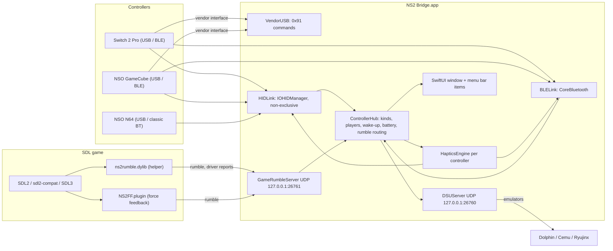

# How NS2 Bridge works

## Controllers

`ControllerKind` (`Sources/NS2Kit/ControllerHub.swift`) describes each supported controller: product ID,
names, sticks, buttons, whether it needs the 0x91 wake-up, its native report format, motion, gate shape
and default calibration.

| Kind | Transport | Wake-up | Input report | Rumble |
|---|---|---|---|---|
| Switch 2 Pro (`2069`) | USB, BLE | 0x91 commands on USB interface 1 (`VendorUSB`) | `0x09` (or `0x05` while motion is on) | HD Rumble 2, report `0x02`, 250 Hz |
| NSO GameCube (`2073`) | USB, BLE | same | `0x0A` | on/off motor, report `0x03`, 4 ms duty cycle |
| NSO N64 (`2019`) | USB, classic Bluetooth | none (macOS does the handshake) | `0x30` (Switch 1) | Switch 1 rumble, report `0x10`, 15 ms |

`ControllerHub` owns the connected controllers:
- **Discovery:** `HIDLink` (IOHIDManager, never seized, so games still see the devices) reports devices by
  their registry object; `BLELink` connects the Switch 2 family over BLE (kind taken from the advertisement).
- **Wake-up and watchdog:** Switch 2 controllers get the start-up sequence on connect and again if reports
  stop for 2 s (sleep, host reset). The N64 over Bluetooth is asked for full reports and vibration.
- **Players:** P1–P8, player lights, swapping.
- **Identity and profiles:** each controller's `deviceKey` (N64: Bluetooth address; Switch 2 family:
  SHA-256 fingerprint of the flash serial, read at connect over USB or BLE). `ProfileStore.assigned` maps it
  to that controller's own profile (created from the kind's default on first connect).
- **Parsing** into a common `ControllerInput`: pressed button names, sticks, triggers, battery, motion.
- **Battery** polling (N64 subcommand 0x50, Switch 2 command 0x0B) and history.
- **Game rumble routing:** a request for a product ID plays on the lowest-numbered player of that kind,
  from any thread.
- **Turn off:** N64 via Switch-1 subcommand 0x06 00; BLE controllers by dropping the link.

## Getting input into games

Games read controllers through SDL. NS2 Bridge sets things up so SDL reads each controller correctly:

- **Switch 2 Pro and GameCube** are read by SDL's generic IOKit backend (`SDL_JOYSTICK_MFI=0`) with
  NS2 Bridge's mapping strings (`SDLMapping`), including firmware-independent GUIDs.
- **N64** must be read by SDL's own HIDAPI driver (the IOKit view is garbage; see research §3), so
  `SDL_JOYSTICK_HIDAPI=1` and `SDL_JOYSTICK_HIDAPI_NINTENDO_CLASSIC=1` are set, overriding games that switch
  it off at normal priority. Engine-specific N64 mappings (N64Recomp, libultraship) are numbered for SDL2
  or SDL3 depending on what the game actually runs (`GameAnalysis.sdl3Backend`).
- These settings reach games two ways: `launchctl setenv` for everything launched from Finder
  (Setup switch), and per game: in the environment when launched from NS2 Bridge, and in
  `~/Library/Application Support/NS2Bridge/games/<bundle id>.env`, which the helper applies at start-up
  when it's installed in the game. Those files are rewritten whenever a setting they contain changes and
  at every NS2 Bridge start.

Native Mac games that use Apple's GameController framework are out of reach: that would need a DriverKit
virtual device, which needs a paid Apple Developer account and an Apple-granted entitlement.

## The game helper (`Hooks/ns2rumble.c`)

One universal dylib for SDL2 and SDL3, with no SDL link dependency. It is loaded either at launch
(`DYLD_INSERT_LIBRARIES`, for games without the hardened runtime) or permanently, by a weak load command
that `GameInstaller` adds to the game's own SDL library (originals backed up, removable). On load it:

1. applies the per-game settings file (unless the game was launched from NS2 Bridge, `NS2_LAUNCHED=1`);
2. **rewrites the game's own symbol pointers** to SDL functions (lazy/non-lazy pointer sections of every
   image except SDL itself, including images loaded later), which works under the hardened runtime;
3. wraps:
   - rumble (`SDL_GameControllerRumble`, `SDL_JoystickRumble`, `SDL_RumbleGamepad`, `SDL_RumbleJoystick`,
     `SDL_GameControllerHasRumble`): Nintendo controllers' rumble goes to NS2 Bridge over UDP;
   - type/name queries, when Xbox mode is on;
   - `SDL_SetHint` / `SDL_SetHintWithPriority`: hints that would switch off the N64's driver are dropped;
   - `SDL_GameControllerGetAxis` / `SDL_GetGamepadAxis`: stick values of Nintendo controllers on the
     IOKit path are rescaled with NS2 Bridge's calibration (`NS2_STICKCAL_<pid>`), so full tilt reads 100%;
   - `SDL_PollEvent` / `SDL_PeepEvents`: 2 s after start and every 5 s, reports each Nintendo controller's
     SDL driver to NS2 Bridge (on change), so a misread N64 is flagged in the Games tab;
   - `SDL_GameControllerOpen` / `SDL_OpenGamepad`: the same report when a controller is opened;
   - `SDL_PollEvent` / `SDL_PeepEvents` / `SDL_PumpEvents` also service the **virtual gamepads**: games can't
     see Switch 2 controllers over Bluetooth (NS2 Bridge holds the connection), so NS2 Bridge streams them to
     every running helper (`VirtualGamepad`, UDP back to the helper's port, which it announces every second)
     and the helper attaches an SDL virtual gamepad per controller, detaching it when updates stop. SDL3
     (found among the loaded images, also when sdl2-compat loaded it privately) adds the gyro and
     accelerometer as virtual sensors; SDL 2.24+ gets input and rumble. Rumble on a virtual pad goes to the
     Bluetooth controller. The same model as Steam Input on macOS: games launched with the helper.
4. carries a version marker (`NS2RUMBLE_VERSION=<n>`) so NS2 Bridge can offer to update installed copies.

UDP packets to `127.0.0.1:26761` (little-endian): `NS2H` hello (pid, SDL major); `NS2R` rumble (low,
high, duration ms, product ID); `NS2B` driver report (pid, product ID, SDL GUID byte 14, SDL major).

## Rumble without touching the game (`Hooks/NS2FF`)

A CFPlugIn implementing the macOS ForceFeedback device interface. NS2 Bridge adds it to each
controller's `IOCFPlugInTypes` registry property (merged with macOS's own entries, never replacing them;
the path is given relative to `/System/Library/Extensions`, as the framework requires) and removes it on
quit. SDL's IOKit backend then reports rumble support and sends its effects, which the plug-in forwards as
`NS2R` packets. Applies to controllers SDL reads through IOKit.

## Motion and DSU

- Motion mode: Off, Always on, or **Automatic** (default): the model asks the DSU server which slots have
  listeners (`listeningSlots`, twice a second) and switches the Pro to 0x05 only while one is listening.
- `OrientationFilter` (Mahony-style gyro + accelerometer) drives the Motion tab's SceneKit 3D view.
- `MotionDecoder` reads report 0x05's IMU fields into SDL's sensor frame (accel in g, gyro in °/s), with
  SDL's scale selection based on the IMU clock rate, measured against the Mac's clock. `GyroCalibrator`
  averages a still period into a per-controller offset.
- `DSUServer` implements the CemuHook protocol (version, port info, pad data; CRC32; clients expire after
  5 s). Slots 0–3 are players 1–4. Every controller kind is mapped to DualShock positions; motion is
  converted from SDL's frame to the DSU frame.

## Games analysis and installation

`GameAnalyzer` inspects an app with `nm`, `codesign` and string scans: SDL rumble imports (SDL2/SDL3),
static SDL, hardened runtime and library validation, engine (N64Recomp / libultraship), sdl2-compat, whether
its SDL has the N64 driver (otherwise the N64 is hidden from it), and whether game code names the hints that
switch it off. `GameInstaller` + `MachOPatcher` install, update and remove the helper: new files are always
written beside the original and swapped in atomically (the kernel kills processes that load a signed file
changed in place), then re-signed only as far as macOS requires.

## Threading

| Work | Where |
|---|---|
| USB HID reports | main run loop (IOHIDManager callback), up to ≈ 250/s per controller |
| 0x91 commands | serial background queue (blocking bulk transfers) |
| Bluetooth LE | its own `.userInteractive` queue |
| Haptics | one strict `DispatchSourceTimer` per controller, stopping itself when idle |
| Game rumble | UDP listener queue → controller's haptics directly (never the main thread) |
| DSU | its own queue; packets built from the main thread's reports |
| UI | SwiftUI, the selected controller published at 60 Hz |

## Files

| Path | What |
|---|---|
| `Sources/NS2Kit/` | Library: transports, protocols, controllers, haptics, motion, DSU, calibration, analyzer, installer |
| `Sources/NS2BridgeApp/` | SwiftUI app and menu bar items |
| `Sources/ns2probe/` | Command-line probe used for reverse engineering and captures |
| `Hooks/` | `ns2rumble.c` (game helper), `NS2FF/` (force-feedback plug-in) |
| `tools/sdlcheck.c`, `scripts/sdl-check.sh` | Checks a game's own SDL against Nintendo controllers |
| `scripts/` | `build-app.sh`, `package.sh`, `make-icon.swift` |
| `Tests/` | Unit tests (protocols, encoders, calibration, motion, DSU wire format and UDP round trip, analyzer) |
| `research/` | Raw captures, measurements and reproduction scripts |
