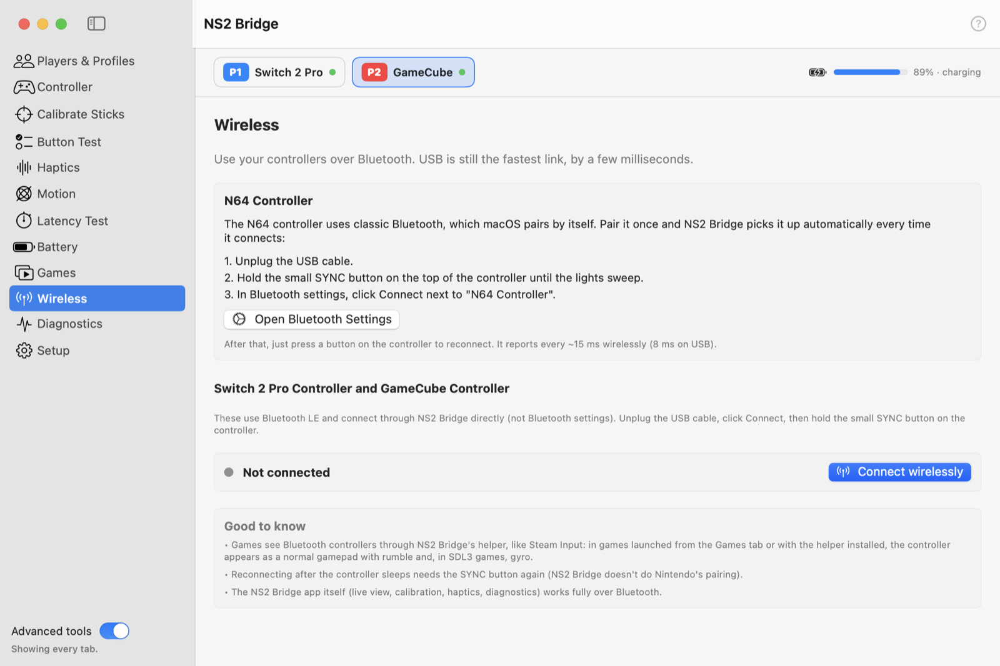

# Bluetooth

<picture>
  <source media="(prefers-color-scheme: dark)" srcset="../images/tab-wireless-dark.png">
  
</picture>

## Connecting

| Controller | How |
|---|---|
| **NSO N64** | Classic Bluetooth, paired by macOS. Unplug the cable, hold the small **SYNC** button until the lights sweep, then click **Connect** next to "N64 Controller" in Bluetooth settings. Afterwards, any button reconnects it. |
| **Switch 2 Pro**, **NSO GameCube** | Bluetooth LE, connected by NS2 Bridge (not Bluetooth settings). Unplug the cable, click **Wireless → Connect wirelessly**, then hold the small **SYNC** button on the controller. Connects in about 10 seconds. |

NS2 Bridge doesn't do Nintendo's own pairing, so after a Switch 2 controller sleeps, reconnect it with **Connect**
and SYNC again. One Switch 2 controller can be connected over Bluetooth at a time.

## Speed

The controller sends one report per Bluetooth connection event, so the connection interval decides latency.
The controller never asks for a fast one, and macOS on its own uses 30 ms. NS2 Bridge asks macOS for a shorter
interval:

| Speed | Interval | Reports per second | Notes |
|---|---|---|---|
| **Fastest** (default) | 7.5 ms | 133 | Within a few ms of USB (4 ms). Falls back to Fast by itself if reports stop arriving. |
| **Fast** | 15 ms | 67 | |
| **Standard** | ~30 ms | 34 | macOS's own choice; documented macOS interfaces only. |

Fastest and Fast use an undocumented macOS interface (see [LEGAL.md](https://github.com/info-moed/NS2Bridge/blob/main/LEGAL.md));
if a future macOS ignores it, NS2 Bridge simply runs at macOS's 30 ms. The Switch 2 console uses 5 ms, which the
Mac's Bluetooth chip doesn't accept. Faster speeds likely use somewhat more of the controller's battery.

The [Latency Test](latency.md) measures what you actually get.

## What works over Bluetooth

Everything in NS2 Bridge itself (live view, calibration, haptics, motion, battery, diagnostics), emulators over DSU,
and games through the helper's [virtual gamepad](games.md#bluetooth-controllers-in-games).
