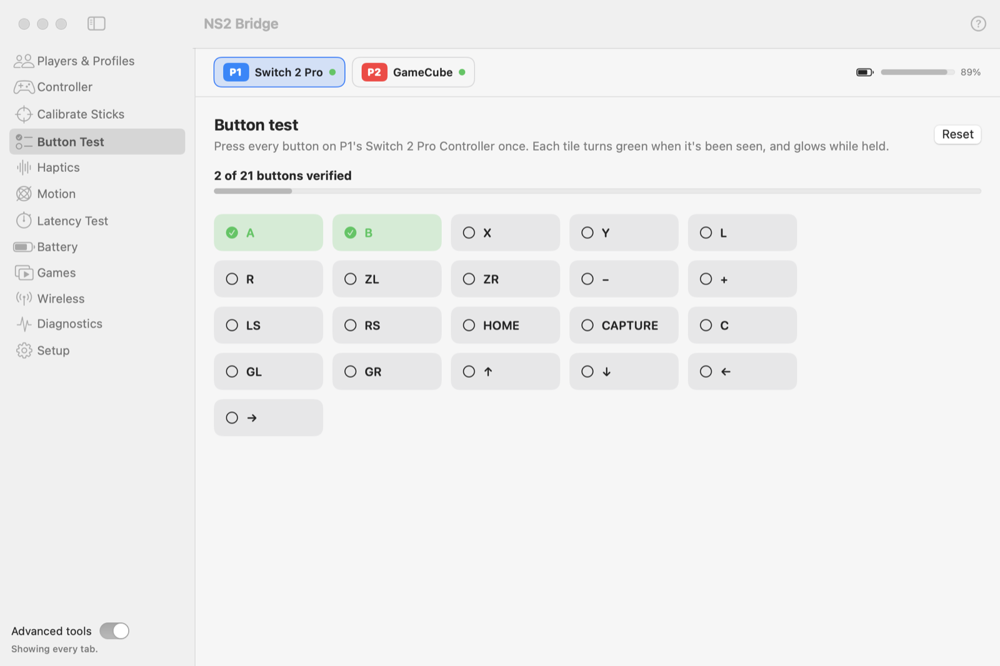

# Button Test (Advanced)

Press every button on the selected controller once: each tile turns green when it's been seen and glows while held.
A quick way to check a controller, or that a remapping did what you expect. **Reset** starts over.

<picture>
  <source media="(prefers-color-scheme: dark)" srcset="../images/tab-button-test-dark.png">
  
</picture>

The Switch 2 Pro has 21 buttons, including **C**, **GL** and **GR** (the back buttons) and **CAPTURE**.
