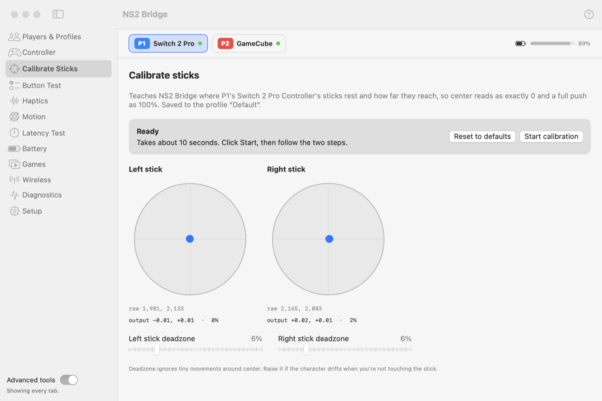

# Calibrate Sticks

Teaches NS2 Bridge where the selected controller's sticks rest and how far they reach, so center reads exactly 0
and a full push reads 100%. Saved to the controller's [profile](controllers.md#profiles). Games launched with the
helper and emulators using DSU get the calibrated values.

<picture>
  <source media="(prefers-color-scheme: dark)" srcset="../images/tab-calibrate-sticks-dark.png">
  
</picture>

1. Click **Start calibration**.
2. **Center:** let go of both sticks for a moment.
3. **Range:** roll each stick slowly around its edge a few times.

It takes about 10 seconds. **Reset to defaults** goes back to factory-typical values.

**Deadzone** ignores tiny movements around center (default 6%). Raise it if a character drifts while you're not
touching the stick. The N64 stick's octagonal gate is handled so the diagonals still reach full tilt.

## GameCube trigger test

For the NSO GameCube controller, the tab also has a **Trigger test** for the analog **L** and **R** triggers. Click
**Start trigger test**, then: step 1, don't touch the triggers; steps 2 and 3, press L, then R, all the way to the
click and release. It checks that each trigger rests still, travels smoothly all the way and clicks only at the
end, then saves their range to the profile, so a full press reads 100%.

Some games add their own deadzone and sensitivity on top (BattleShip, for example, uses 20%).
