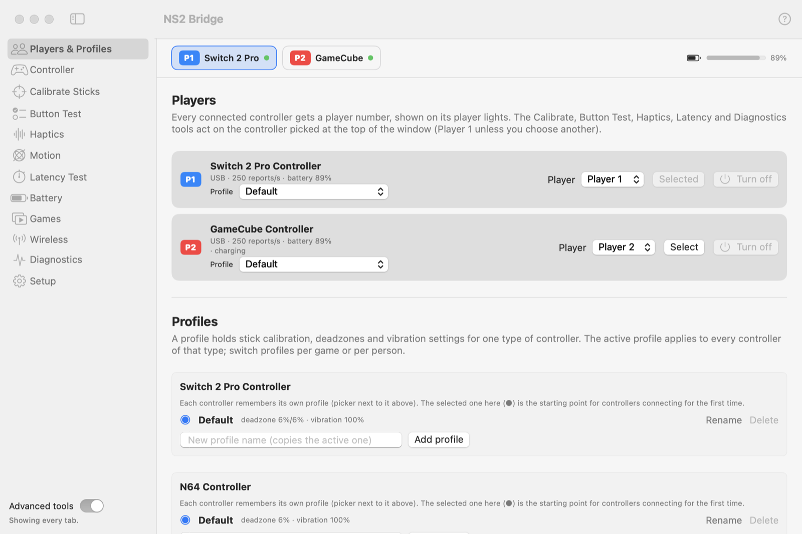

# Controllers and players

## The menu bar

Each connected controller gets a colored pill in the menu bar: its short name (**PC2** Switch 2 Pro, **GC**
GameCube, **N64**), player number and battery. Click a pill for its menu; **double-click** to turn a wireless
controller off. With no controller connected, a plain icon takes their place. If the pills don't fit (for
example behind the camera notch), NS2 Bridge says so in the window.

## Controller tab: live view

A picture of the selected controller: buttons light up, sticks move, analog triggers fill. Below it, each stick's
raw and calibrated values and the active profile. Useful to check a controller before playing.

<picture>
  <source media="(prefers-color-scheme: dark)" srcset="../images/tab-controller-dark.png">
  
</picture>

## Players & Profiles tab

**Players:** every connected controller gets a player number, shown on its player lights. Change it with the
**Player** menu (the other controller swaps), pick which controller the tools act on with **Select**, and turn a
wireless controller off with **Turn off** (USB controllers are powered by the Mac; unplug them instead).

<picture>
  <source media="(prefers-color-scheme: dark)" srcset="../images/tab-players-profiles-dark.png">
  
</picture>

### Profiles

A profile holds stick calibration, deadzones and vibration settings for one type of controller.

- **Each physical controller remembers its own profile**, identified by a fingerprint of its serial number (Switch 2
  family) or its Bluetooth address (N64). Two Pro Controllers can have different settings.
- The selected profile (●) in each section is the starting point for controllers connecting for the first time.
- **Add profile** copies the active one under a new name; **Rename** and **Delete** do what they say.
- Switch profiles per game or per person with the profile menu next to each controller.
