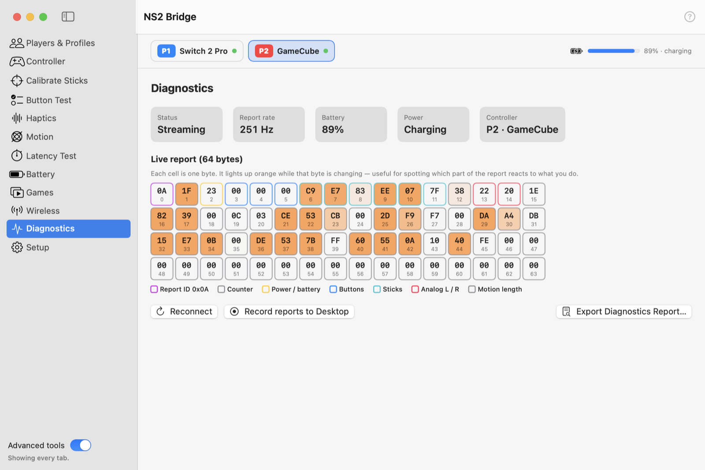
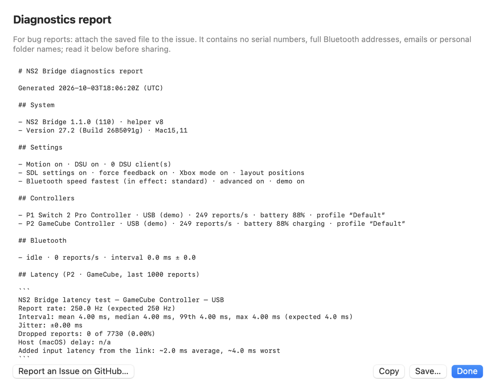

# Diagnostics (Advanced)

<picture>
  <source media="(prefers-color-scheme: dark)" srcset="../images/tab-diagnostics-dark.png">
  
</picture>

- **Status, report rate, battery, power** for the selected controller.
- **Live report:** every byte of the controller's input report. A cell lights up orange while it's changing, and the
  colors show what each byte is (buttons, sticks, battery, IMU, accelerometer and gyro).
- **Reconnect** sends the controller's wake-up sequence again.
- **Export Diagnostics Report…** (also in the menu bar menu → Help) builds a report for bug reports: versions, Mac,
  settings, controllers, Bluetooth, latency, games and the last 15 minutes of NS2 Bridge's log. Your home folder path,
  serial numbers, full Bluetooth addresses and email addresses are removed, and you see the whole report before you
  copy or save it.
<picture>
  <source media="(prefers-color-scheme: dark)" srcset="../images/diagnostics-report-dark.png">
  
</picture>

- **Record reports to Desktop** saves a capture (`.ns2cap`) for protocol research. Captures can contain the
  controller's serial number: check them before sharing.
