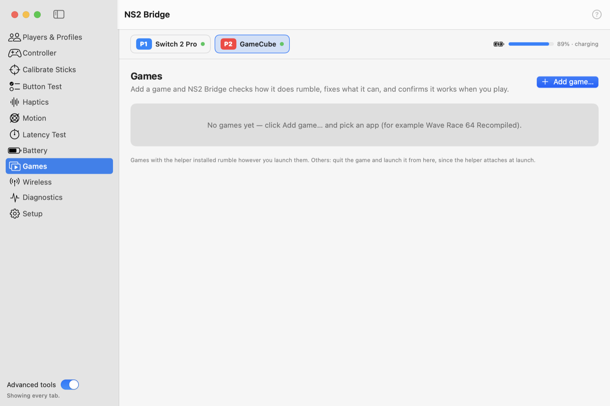

# Games

Most Mac ports and recompiled games (Wave Race 64 Recompiled, BattleShip, and other N64 recompilations) read
controllers through **SDL**. NS2 Bridge makes them work fully:

| What | How |
|---|---|
| Buttons and sticks | **Setup → Let SDL games and emulators use this controller** tells SDL how to read the controllers. |
| Rumble, full stick range, the N64 driver guard | NS2 Bridge's **helper** inside the game. |
| Controllers connected over Bluetooth | The helper presents them to the game as normal gamepads. |

<picture>
  <source media="(prefers-color-scheme: dark)" srcset="../images/tab-games-dark.png">
  
</picture>

## Adding a game

**Games → Add game…** and pick the app. NS2 Bridge checks how the game uses SDL and shows one of:

- **Ready:** click **Play with rumble**. The helper attaches at launch; nothing in the game changes.
- **Install the rumble helper into this game:** macOS blocks launch-time helpers for this game's build. One click
  installs the helper inside the game (the originals are backed up first), and then it works however you launch
  the game: Finder, Dock or Steam. **Update helper in game** appears when NS2 Bridge has a newer helper;
  **Remove helper from game** restores the original files exactly.
- **Not supported:** SDL is built into the game, or the game has no rumble. You can still play.

A live checklist confirms each step: game launched → helper attached → rumble received. Each game's row also shows
which SDL driver the last run gave each controller, and warns if the N64 controller got the wrong one.

## Bluetooth controllers in games

macOS doesn't show Switch 2 controllers connected over Bluetooth to games: NS2 Bridge holds that connection. So,
much like **Steam Input**, NS2 Bridge's helper creates a virtual gamepad inside the game for each Bluetooth
controller:

- It appears and disappears with the controller, mid-game included. Nothing to set up.
- **Rumble** goes back to the Bluetooth controller.
- **Gyro and accelerometer** work in games using SDL3, including ones built on sdl2-compat (BattleShip). SDL2 has no
  virtual motion sensors.
- It needs SDL 2.24 or later, and the game must run with the helper: launched from the Games tab, or with the
  helper installed. Games started any other way don't see Bluetooth controllers.

## Rumble without the helper

**Setup → Rumble in SDL games through macOS force feedback** adds NS2 Bridge's force-feedback plug-in to each
connected controller, so games reading the Switch 2 Pro as a generic joystick see rumble support without any
helper. The plug-in is removed when NS2 Bridge quits.

## Xbox mode and button layout

**Setup → Show up as an Xbox controller in games** (on by default) makes games launched from the Games tab show Xbox
button prompts and accept the controller where they only take Xbox-style pads. **Button layout:** *Match positions*
(the bottom button is A, Xbox style) or *Match labels* (the button marked A is A, Nintendo style).

See also: [Troubleshooting games](../reference/troubleshooting.md#games), [Compatibility](../reference/compatibility.md).
