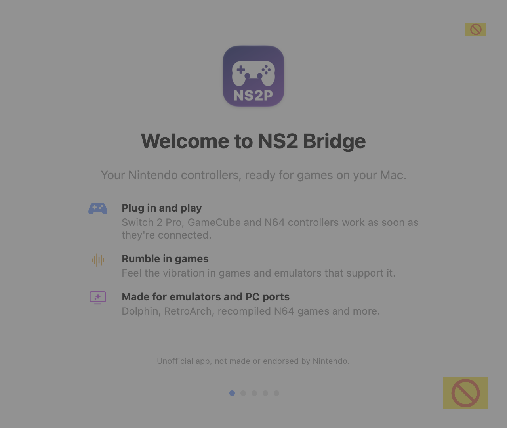

# Getting started

## 1. Install

1. Download `NS2Bridge-<version>-macOS.zip` from the
   [latest release](https://github.com/info-moed/NS2Bridge/releases/latest) and double-click it.
2. Drag **NS2 Bridge.app** into **Applications**.
3. Open it. Because NS2 Bridge isn't signed with a paid Apple Developer ID, macOS blocks the first launch:
   click **Done**, open **System Settings → Privacy & Security**, click **Open Anyway** next to "NS2 Bridge was
   blocked", and confirm. You only do this once per version.

More detail, including checking the download's SHA-256 and building from source: [Install](../INSTALL.md).

## 2. The welcome tour

Every new installation opens a five-page tour: connecting, playing, adjusting, then a choice between
**Basic** (the everyday tabs) and **Advanced** (everything), whether to open NS2 Bridge at login, and whether to be
told about updates. Reopen it any time from **Setup → Show the welcome guide again**. After an update, a short
**What's new** follows.

<picture>
  <source media="(prefers-color-scheme: dark)" srcset="../images/welcome-1-dark.png">
  
</picture>

## 3. Connect a controller

- **USB:** plug the controller in with a USB-C **data** cable (charge-only cables don't work). It's ready in about a
  second: a colored pill appears in the menu bar with its player number, and its player lights turn on.
- **Bluetooth:** see [Bluetooth](bluetooth.md). The NSO N64 controller pairs in macOS's Bluetooth settings; the
  Switch 2 Pro and GameCube controllers connect through NS2 Bridge's **Wireless** tab.

No controller at hand? Turn on **Setup → Demo mode** to explore with two recorded controllers.

## 4. Play

- **Emulators** (Dolphin, Cemu, Lime3DS, …): use NS2 Bridge's DSU server for gyro and analog triggers.
  See [Emulators](emulators.md).
- **SDL games** (most Mac ports and recompiled N64 games): turn on **Setup → Let SDL games and emulators use this
  controller**, then add the game in the **Games** tab and launch it from there for rumble and full stick range.
  See [Games](games.md).

## 5. Adjust

[Calibrate the sticks](calibration.md) once, set [vibration strength](haptics.md), and give each person or game its
own [profile](controllers.md#profiles).
