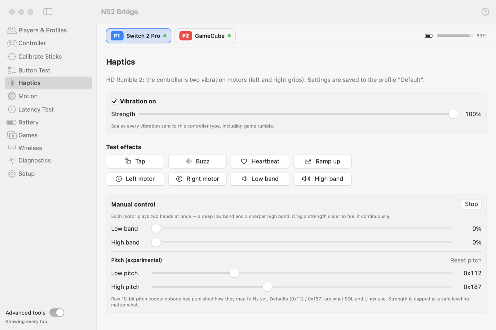

# Haptics

The Switch 2 Pro Controller has **HD Rumble 2**: two linear motors (left and right grips), each playing two bands at
once, a deep low band and a sharper high band. Settings are saved to the controller's profile.

<picture>
  <source media="(prefers-color-scheme: dark)" srcset="../images/tab-haptics-dark.png">
  
</picture>

- **Vibration on / Strength** scale every vibration sent to this controller type, including rumble from games.
- **Test effects:** Tap, Buzz, Heartbeat, Ramp up, each motor alone, each band alone.
- **Manual control:** drag the Low band and High band sliders to feel each band continuously; **Stop** ends it.
- **Pitch (experimental):** the raw 10-bit pitch codes. Nobody has published how they map to hertz yet; the
  defaults are the values SDL and Linux use.

Strength is capped at a safe level no matter what: open-source drivers note that the top of the range can damage
the motors.

**NSO GameCube controller:** its single motor is only on or off, as on the console. NS2 Bridge drives it fast enough
to produce three distinct strengths. **NSO N64 controller:** original-Switch rumble.
