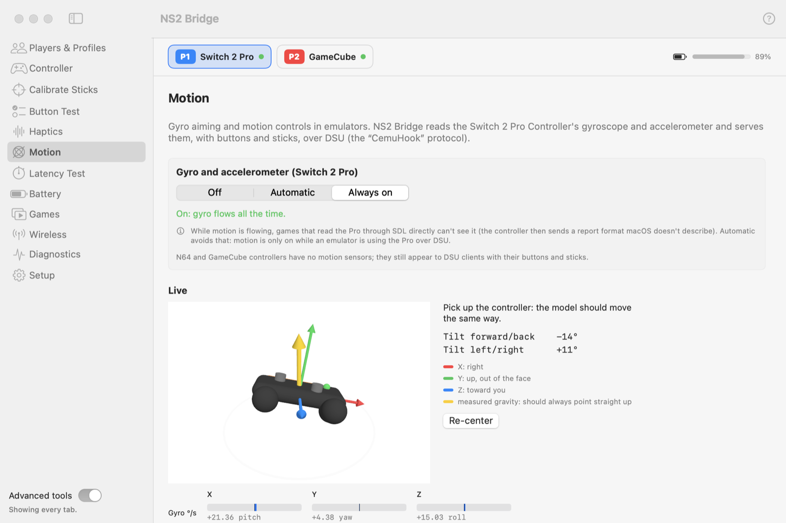

# Motion

The Switch 2 Pro Controller's gyroscope and accelerometer, for emulators (over [DSU](emulators.md)) and games (over
the helper's virtual gamepad for Bluetooth controllers).

<picture>
  <source media="(prefers-color-scheme: dark)" srcset="../images/tab-motion-dark.png">
  
</picture>

## Modes

| Mode | When motion flows |
|---|---|
| **Automatic** (default) | While an emulator is using the Pro over DSU; off a few seconds after it stops. Over Bluetooth, whenever the Pro is connected. |
| **Always on** | All the time. |
| **Off** | Never. |

Why not always on? While motion flows over **USB**, the controller sends a report format macOS doesn't describe, so
games reading the Pro directly through SDL see no input. Automatic avoids that. Over **Bluetooth**, games never read
the controller directly (they use the helper), so motion costs nothing there.

## Live view

A 3D model of the controller follows its orientation, with its axes (X right, Y up out of the face, Z toward you)
and the measured gravity, which should always point straight up. **Re-center** resets the heading. The bars below
show the gyro in degrees per second.

## Gyro calibration

Every gyro reads slightly off zero when still, which makes aim drift. Put the controller down on a table and click
**Calibrate gyro**: NS2 Bridge measures the offset for 3 seconds and removes it from then on, per physical
controller. It rejects the run if the controller moved. **Reset** removes the correction.

## DSU server

The bottom of the tab shows the DSU server (`127.0.0.1:26760`), how many emulators are listening, and short setup
notes. See [Emulators](emulators.md).

## Accuracy

Verified on hardware: integrating the gyro alone and comparing with the accelerometer after turns of up to 289 °/s
gave a median error of 0.3° (worst 5°). Motion over Bluetooth matches USB.
