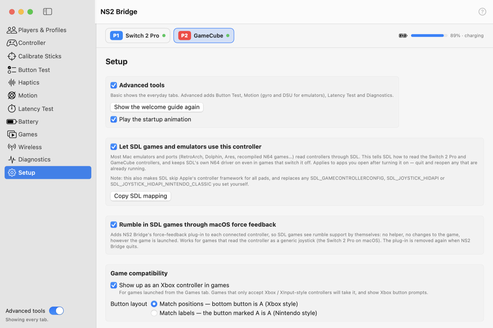

# Setup

<picture>
  <source media="(prefers-color-scheme: dark)" srcset="../images/tab-setup-dark.png">
  
</picture>

| Setting | What it does |
|---|---|
| **Advanced tools** | Shows Button Test, Motion, Latency Test and Diagnostics. **Show the welcome guide again** reopens the tour. **Play the startup animation** turns the intro on or off (it's skipped anyway when macOS's Reduce Motion is on; click or press a key to skip it). |
| **Let SDL games and emulators use this controller** | Tells SDL (used by most emulators and ports) how to read the Switch 2 Pro and GameCube controllers, keeps SDL's own N64 driver on, and makes SDL skip Apple's controller framework. Applies to apps opened afterwards. A small login item re-applies it after you log in. **Copy SDL mapping** copies the mappings for your own use. |
| **Rumble in SDL games through macOS force feedback** | Adds NS2 Bridge's force-feedback plug-in to each connected controller, so SDL games see rumble without the helper. Removed when NS2 Bridge quits. |
| **Show up as an Xbox controller in games** | For games launched from the Games tab: Xbox button prompts, accepted where only Xbox-style pads are. |
| **Button layout** | *Match positions* (bottom button = A, Xbox style) or *Match labels* (the button marked A is A, Nintendo style). |
| **Open NS2 Bridge at login** | Keeps it in the menu bar, so controllers work the moment you plug them in. |
| **Check for updates automatically** | Once a day, asks GitHub whether a newer release exists (nothing else is sent). Off by default; **Check Now** checks once. A banner and the menu bar menu show an available update; you download it yourself. |
| **Demo mode** | Plays back a recorded Switch 2 Pro and GameCube controller so every tab shows live data. Turns off when NS2 Bridge quits. |
| **Reset NS2 Bridge…** | Removes everything NS2 Bridge set up (the helper from games, with their original files restored; SDL settings; login items; all settings and data), then relaunches with the welcome tour. |
